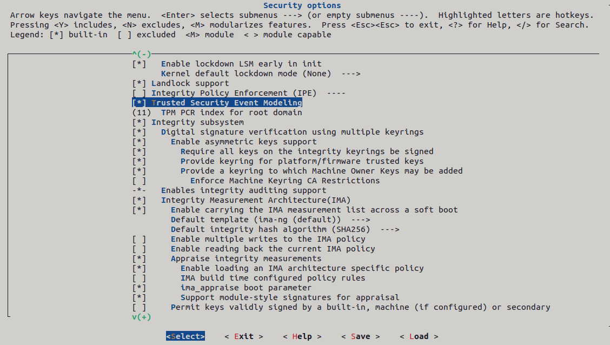

Installation
============

.. _installation:

Building TSEM kernel
--------------------

Installation of :term:`TSEM` infrastructure, like it or not, involves
compilation of the Linux kernel. For this reference, I'm using Ubuntu 22.04 as
it seems to be, what the developers do some of their testing on (as mentioned in
parts of Quixote documentation https://github.com/Quixote-Project/Quixote).

Getting the kernel code
~~~~~~~~~~~~~~~~~~~~~~~

Acquire the kernel source code with the :term:`TSEM` patches. This can be done
in following ways:

    - Download the source code from the official linux kernel git
      repository and apply the TSEM patches manually from linux kernel mailing
      list. (https://blog.reds.ch/?p=1814 can serve as a good guide for that)

    - Or more preferably clone the kernel provided by the Quixote
      project: https://github.com/Quixote-Project/TSEM
      Like so: :code:`git clone --depth 1 --all <most recent kernel version> https://github.com/Quixote-Project/TSEM`
   
<most recent kernel version> being the most recent kernel version available
in the :term:`TSEM` repos.
For example at the time of writing it would be:

.. code-block:: console

   $ git clone --depth 1 --branch TSEM-6.12 https://github.com/Quixote-Project/TSEM

.. image:: images/installation/TSEM-clone.png
   :align: center

Dependencies
~~~~~~~~~~~~

Following dependencies will need to be installed before proceeding with the
compilation:

.. code-block:: console

   $ sudo apt-get install git gcc make build-essential libncurses5-dev fakeroot ncurses-dev xz-utils libssl-dev bc flex libelf-dev bison exuberant-ctags

Dependencies needed for successful kernel compilation always vary, but the
difference will almost always be in the package names.

Generating kernel *.config*
~~~~~~~~~~~~~~~~~~~~~~~~~~~

In order to compile Linux kernel one will also need a suitable *.config*
file. This can be copied form a working distribution (for example the one where
the compilation is to be done):

.. code-block:: console

   $ cat /lib/modules/$(uname -r)/build/.config > .config

Or generated using: 

.. code-block:: console

   $ make localmodconf

in kernel compilation directory. This is a suggested approach for most users as
compiling kernel with all the drivers/modules built into the kernel can take a
vary long time -- depending on the computer's processing power.

Next enable :term:`TSEM` in the *.config*, there are many ways to do this.

.. image:: images/installation/menconf-1.png
   :align: center

Use **make menuconfig** and select **Trusted Security Event Modeling** option
under **Security options**, set **TPM PCR index for root domain** to **11**

and add string "tsem" to the **Ordered list of enabled LSMs** at the buttom of
the page.

.. image:: images/installation/menconf-4.png
   :align: center

Don't forget to save and exit.

Adding "-tsem" or some other name to the **Local version** option in **General
setup** of the menuconfig is recommended for easier determination if the correct
kernel is installed afterwards.

Building the kernel
~~~~~~~~~~~~~~~~~~~

After successful completion of the previous steps the kernel can be compiled.

run:

.. code-block:: console

   $ make -j$(nproc)

.. note::
    The "-j$(nproc)" part is optional however heavily recommended since it
   utilizes all CPU cores, not just one (default). Or it can be replaced with
   any desired number of cores. If one does not know how many cores exactly they
   want to utilize (e.g. make -j2 for 2 cores). Blindly guessing by putting some
   ridiculously big number should work as well as it will use all cores
   available.

After finishing the previous command make sure to install all compiled modules:

.. code-block:: console

   $ sudo make modules_install

And finally install the kernel:

.. code-block:: console

   $ sudo make install

Reboot your system. After the reboot make sure to check if the TSEM kernel is
installed and that the "tsem" is in the list of enabled :term:`LSM`\s:

.. code-block:: console

   $ uname -r
   $ cat /sys/kernel/security/lsm

.. image:: images/installation/cat-lsm.png
   :align: center

If there is "tsem" in the list of enabled :term:`LSM`\s, move on to the
*Quixote* setup.

Don't worry about the trailing hostname at the end --- some Linux distributions
put newline at the end of the *lsm* string, others don't.

Quixote setup
-------------

Quixote can be acquired in two ways:
    - downloading from ftp://ftp.enjellic.com/pub/Quixote (outdated at the time
      of writing --- not recommended)
    - compiling from source (covered in this section)

Getting the source code
~~~~~~~~~~~~~~~~~~~~~~~

Downloading the Quixote sources can get a little tricky.

Firstly clone the Quixote repository using:

.. code-block:: console

   $ git clone --recurse-submodules https://github.com/Quixote-Project/Quixote.git

.. admonition:: Possible Issue

    In case, you don't have github setup with your RSA key --- *ssh* method, the you
    will be asked to confirm fingerprint of github.com, the he will fail, since the
    sub-repository is referenced by ssh (git@...). An effective but a little dirty
    workaround for that would be manually rewriting the *ssh* access method to web
    URL and retrying the pull:

.. code-block:: console

   $ cd Quixote
   $ sed -i 's/url = git@github.com:Quixote-Project\/HurdLib.git/url = https:\/\/github.com\/Quixote-Project\/HurdLib.git/g' .git/config
   $ git pull --recurse-submodules

.. note::
    It is not recommended to interact with git configs manually, but so is
    interacting with github web URLs.

Dependencies
~~~~~~~~~~~~

For compilation of Quixote, at minimum these packages are needed:

.. code-block:: console

   $ sudo apt-get git gcc make flex libssl-dev libcap-dev libxen-dev pkg-config elfutils

One should already heave some of them from :term:`TSEM` kernel compilation.
Complete list of packages is mentioned in case of compilation on systems with
pre-compiled kernel installed.

The compilation is quite straight forward:

.. code-block:: console

   $ make

.. warning::
   In case of using more CPU cores --- the "-j" argument, one may encounter race
   conditions during compilation ---  recompile the Quixote multiple times to
   get it right as the dependencies aren't set up correctly and a race condition
   might occur, where a file starts compiling before all its dependencies are
   compiled, resulting in compilation error. Therefore using just the default
   one core is recommended, as it isn't too long of a compilation.

Installation
~~~~~~~~~~~~

Installation is also very straight forward: 

.. code-block:: console

   $ sudo make install

PATH
~~~~

This falls more into the usage category, it's good practice to put the
installation paths into the *PATH* variable for ease of use.

For example like so:

.. code-block:: console

   $ echo "PATH=/opt/Quixote/sbin:/opt/Quixote/bin:$PATH" >> /etc/environment

.. note::
    The change will take effect after new shell login/reboot or running
    "source /etc/environment".

Vagrant
-------

Alternative way to set the above up is using the Vagrantfile at:
https://github.com/rolandholik/TSEM-vagrant.

Regarding setting up Vagrant itself, the official documentation should get the
reader onboard: https://developer.hashicorp.com/vagrant/docs/installation.

At the time of writing, there is issue with Virtualbox 7.1 --- Vagrant treats it
as unsupported. Following guide should help fixing it:
https://github.com/hashicorp/vagrant/issues/13501#issuecomment-2346267062.

